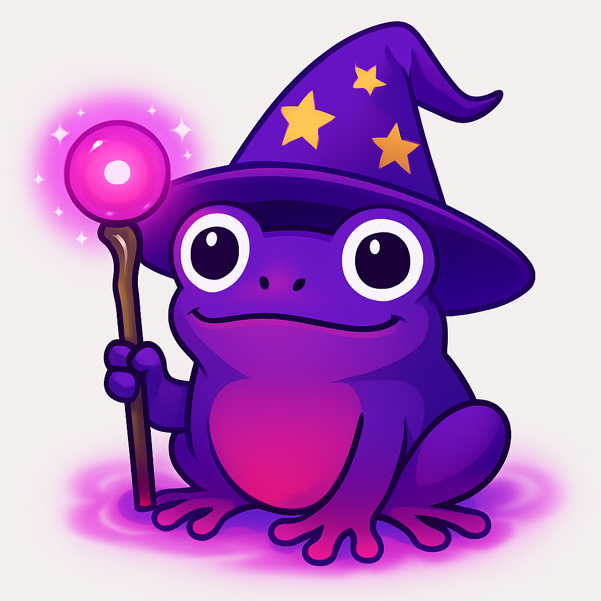

# 🎮 BrawlNads - Monad NFT Battle Royale



**BrawlNads** est un jeu de battle royale révolutionnaire basé sur des NFT entièrement onchain sur la blockchain Monad. Inspiré par l'esthétique meme/memecoin de Monad, le jeu propose des créatures uniques appelées "Monanimals" avec des graphiques SVG générés dynamiquement.

## 🌟 Caractéristiques Principales

### 🎨 NFT SVG Fully Onchain
- **Monanimals** : Créatures NFT uniques avec des statistiques et designs générés aléatoirement
- **Armes & Artefacts** : Équipements NFT pour améliorer les capacités de combat
- **Art SVG Dynamique** : Graphiques entièrement stockés et générés onchain
- **Esthétique Monad** : Design inspiré des couleurs et memes officiels de Monad

### ⚔️ Système de Combat
- **Batailles Automatisées** : Combats basés sur les statistiques et équipements
- **Classes de Monanimals** : Warrior, Assassin, Mage, Berserker, Guardian
- **Système de Rareté** : Common, Uncommon, Rare, Epic, Legendary, Mythic
- **Progression** : Système d'expérience et de level up

### 🏆 Fonctionnalités de Jeu
- **Mint de Monanimals** : Création de nouvelles créatures avec stats aléatoires
- **Forge d'Armes** : Création d'équipements avec différents matériaux
- **Arène de Combat** : Duels 1v1 et tournois
- **Classements** : Leaderboards basés sur les victoires et taux de réussite

## 🛠️ Architecture Technique

### Smart Contracts (Solidity)
- **MonanimalNFT.sol** : Contrat principal pour les créatures NFT
- **WeaponNFT.sol** : Gestion des armes équipables
- **ArtifactNFT.sol** : Artefacts magiques avec effets spéciaux
- **BattleArena.sol** : Système de combat automatisé
- **MonanimalSVGGenerator.sol** : Générateur SVG onchain pour les Monanimals
- **WeaponSVGGenerator.sol** : Générateur SVG onchain pour les armes

### Frontend (React + Web3)
- **React 19** avec Vite pour des performances optimales
- **Tailwind CSS** + **shadcn/ui** pour un design moderne
- **Wagmi** + **Viem** pour l'intégration Web3
- **Framer Motion** pour les animations fluides
- **Design Responsive** compatible mobile et desktop

### Blockchain
- **Monad Testnet** : Déploiement sur la blockchain Monad
- **EVM Compatible** : Utilise les standards ERC-721 pour les NFT
- **Gas Optimisé** : Smart contracts optimisés pour réduire les coûts

## 🚀 Installation et Déploiement

### Prérequis
- Node.js 18+
- npm ou pnpm
- Hardhat pour le déploiement des contrats
- Wallet compatible (MetaMask, etc.)

### Installation

```bash
# Cloner le projet
git clone <repository-url>
cd brawlnads

# Installer les dépendances
npm install

# Installer les dépendances frontend
cd frontend
npm install
```

### Configuration

1. **Variables d'environnement** :
```bash
# Créer un fichier .env
PRIVATE_KEY=your_private_key
MONAD_TESTNET_RPC_URL=https://testnet-rpc.monad.xyz
MONAD_EXPLORER_API_KEY=your_api_key
```

2. **Configuration réseau** :
Le projet est configuré pour Monad Testnet (Chain ID: 10143)

### Déploiement des Smart Contracts

```bash
# Compiler les contrats
npx hardhat compile

# Déployer sur Monad Testnet
npx hardhat run scripts/deploy.js --network monad_testnet

# Vérifier les contrats (optionnel)
npx hardhat verify --network monad_testnet <contract_address>
```

### Lancement du Frontend

```bash
# Mode développement
cd frontend
npm run dev

# Build de production
npm run build

# Prévisualisation de production
npm run preview
```

## 🎯 Guide d'Utilisation

### Pour les Joueurs

1. **Connexion Wallet** : Connectez votre wallet compatible Monad
2. **Mint Monanimal** : Créez votre première créature (0.01 MON)
3. **Forge Équipements** : Créez des armes et artefacts
4. **Combat** : Participez aux duels et tournois
5. **Progression** : Gagnez de l'expérience et montez en niveau

### Pour les Développeurs

1. **Smart Contracts** : Tous les contrats sont dans `/contracts/`
2. **Frontend** : Code React dans `/frontend/src/`
3. **Tests** : Tests Hardhat dans `/tests/`
4. **Scripts** : Scripts de déploiement dans `/scripts/`

## 📊 Économie du Jeu

### Coûts
- **Mint Monanimal** : 0.01 MON
- **Healing** : 0.005 MON
- **Forge Arme** : 0.005 MON
- **Craft Artefact** : 0.01 MON

### Récompenses
- **Victoire en Combat** : 50 XP
- **Défaite** : 20 XP
- **Level Up** : Bonus de statistiques permanents

## 🎨 Design et Esthétique

### Palette de Couleurs Monad
- **Purple Principal** : #836EF9
- **Blue Foncé** : #200052
- **Berry** : #A0055D
- **Off-White** : #FBFAF9
- **Noir** : #0E100F

### Inspiration
Le design s'inspire directement de l'identité visuelle officielle de Monad, incluant :
- Couleurs de la marque Monad
- Esthétique meme/memecoin
- Références à la grenouille violette emblématique
- Design minimaliste et moderne

## 🔧 Structure du Projet

```
brawlnads/
├── contracts/              # Smart contracts Solidity
│   ├── MonanimalNFT.sol
│   ├── WeaponNFT.sol
│   ├── ArtifactNFT.sol
│   ├── BattleArena.sol
│   └── *SVGGenerator.sol
├── scripts/                # Scripts de déploiement
│   └── deploy.js
├── tests/                  # Tests des contrats
├── frontend/               # Application React
│   ├── src/
│   │   ├── components/     # Composants UI
│   │   ├── hooks/          # Hooks Web3 personnalisés
│   │   ├── lib/            # Configuration Web3
│   │   └── assets/         # Images et ressources
│   └── dist/               # Build de production
├── assets/                 # Assets du projet
├── hardhat.config.js       # Configuration Hardhat
└── package.json
```

## 🌐 Liens Utiles

- **Monad Official** : https://monad.xyz
- **Monad Testnet Explorer** : https://testnet.monvision.io/
- **Monad Brand Kit** : https://monad.xyz/brand-and-media-kit
- **Documentation Monad** : https://docs.monad.xyz

## 🤝 Contribution

Les contributions sont les bienvenues ! Pour contribuer :

1. Fork le projet
2. Créez une branche feature (`git checkout -b feature/AmazingFeature`)
3. Commit vos changements (`git commit -m 'Add some AmazingFeature'`)
4. Push vers la branche (`git push origin feature/AmazingFeature`)
5. Ouvrez une Pull Request

## 📝 Licence

Ce projet est sous licence MIT. Voir le fichier `LICENSE` pour plus de détails.

## 🎮 Roadmap

### Phase 1 (Actuelle) ✅
- [x] Smart contracts de base
- [x] Génération SVG onchain
- [x] Interface utilisateur React
- [x] Intégration Web3
- [x] Système de combat basique

### Phase 2 (À venir)
- [ ] Tournois multi-joueurs
- [ ] Marketplace NFT intégré
- [ ] Système de guildes
- [ ] Récompenses saisonnières

### Phase 3 (Futur)
- [ ] Déploiement Monad Mainnet
- [ ] Mobile App
- [ ] Intégration DeFi
- [ ] Gouvernance DAO

## 🏆 Équipe

Développé avec ❤️ pour l'écosystème Monad

---

**BrawlNads** - Où les memes rencontrent la blockchain ! 🐸⚔️

